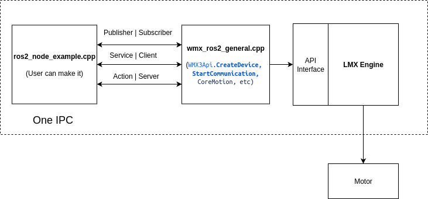
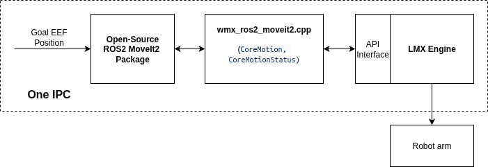

# WMX ROS2 Application

ROS2 interface for [WMX3](https://www.movensys.com/), a real-time EtherCAT motion control SDK by Movensys, enabling control of industrial robots and multi-axis systems from the ROS2 ecosystem.

This package wraps the WMX3 C++ API into standard ROS2 nodes, topics, services, and actions — so you can drive WMX3-controlled hardware (e.g. the CR3A manipulator) using MoveIt2, Nav2, or any ROS2-compatible planner without writing vendor-specific motion code.

## Architecture

**Low-level Control ([wmx_ros2_general.launch.py](wmx_ros2_package\launch\wmx_ros2_general.launch.py)):**



- [wmx_ros2_general_example.cpp](wmx_ros2_package\example\wmx_ros2_general_example.cpp) -> services/topics -> wmx_ros2_general_node -> WMX3 API (CreateDevice, StartCommunication, CoreMotion) -> LMX(WMX Linux runtime)


**Trajectory Control ([wmx_ros2_manipulator.launch.py](wmx_ros2_package\launch\wmx_ros2_manipulator.launch.py)):**



/follow_joint_trajectory (action) -> follow_joint_trajectory_server -> WMX3 API -> LMX(WMX Linux runtime) -> Robot

Robot -> LMX(WMX Linux runtime) -> WMX3 API -> manipulator_state -> /joint_states

## Packages

**wmx_ros2_message** - Custom messages and services for axis control

**wmx_ros2_package** - Main nodes for robot control

## Nodes

**manipulator_state** - Publishes joint feedback from WMX3 encoder to `/joint_states`

**follow_joint_trajectory_server** - Receives trajectory action and executes via WMX3 C-Spline

**wmx_core_motion_node** - Core motion control and trajectory execution

**wmx_engine_node** - Engine and device initialization, overall state management

**wmx_ethercat_node** - EtherCAT master operations and slave management

**wmx_io_node** - IO control for input/output bits and bytes

## Launch Files

**[wmx_ros2_manipulator.launch.py](wmx_ros2_package\launch\wmx_ros2_manipulator.launch.py)** - For trajectory control (starts `manipulator_state` + `follow_joint_trajectory_server`)

**[wmx_ros2_general.launch.py](wmx_ros2_package\launch\wmx_ros2_general.launch.py)** - For low-level axis control (starts `wmx_ros2_general_node`)

## MoveIt2 Integration

To connect with `movensys_isaac_manipulator`, change action name in `follow_joint_trajectory_server.cpp:80`:

```cpp
"/movensys_manipulator_arm_controller/follow_joint_trajectory"
```

## Documentation

To quickly set up the WMX ROS2 package and explore its key features, follow these steps:
| Doc | Description |
|-----|-------------|
| [doc/1_setup.md](doc/1_setup.md) | Environment setup, dependencies, build |
| [doc/2_run_wmx_ros2_package.md](doc/2_run_wmx_ros2_package.md) | Run the general package |
| [doc/3_launch_cr3a_manipulator.md](doc/3_launch_cr3a_manipulator.md) | Launch the CR3A manipulator |
| [doc/4_service_reference.md](doc/4_service_reference.md) | ROS2 service reference with startup sequence |

For the complete and up-to-date documentation, please visit the official site:
**[WMX ROS2 Documentation](https://movensys.github.io/wmx-ros2-doc/)**

## Demo Videos

### Physical AI powered by WMX ROS2 on NVIDIA Jetson Thor
[](https://youtu.be/fUEmNoovdCs?si=W0B1jxY7-t3GnhNI)
