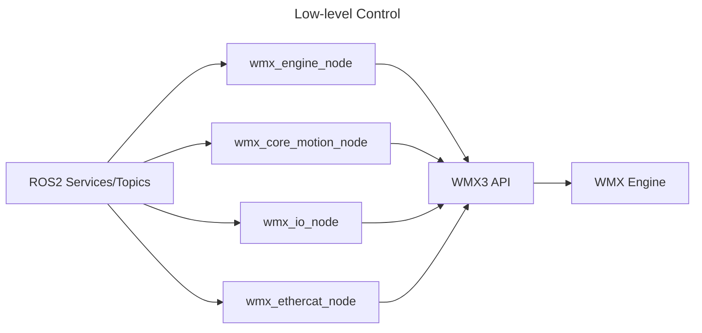
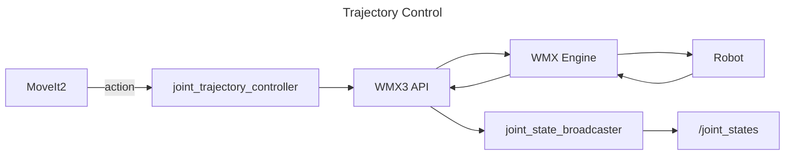

# WMX R2 Application

ROS2 interface for [WMX3](https://www.movensys.com/en/products/software_motion_control/wmx_en), a real-time EtherCAT motion control SDK by Movensys, enabling control of industrial robots and multi-axis systems from the ROS2 ecosystem.

This package wraps the WMX3 C++ API into standard ROS2 nodes, topics, services, and actions — so you can drive WMX3-controlled hardware (e.g. the Dobot CR3A manipulator) using MoveIt2, Nav2, or any ROS2-compatible planner without writing vendor-specific motion code.

## Architecture

### Low-level Control ([wmx_r2_general.launch.py](wmx_r2_package/launch/wmx_r2_general_package.launch.py))


```mermaid
---
title: Low-level Control
---
flowchart LR;
    A[ROS2 Services/Topics] --> B[wmx_engine_node];
    A --> C[wmx_core_motion_node];
    A --> D[wmx_io_node];
    A --> E[wmx_ethercat_node];
    B --> F[WMX3 API];
    C --> F;
    D --> F;
    E --> F;
    F --> G[WMX Engine];
```


### Trajectory Control ([wmx_r2_cr3a_manipulator.launch.py](wmx_r2_package/launch/wmx_r2_cr3a_manipulator.launch.py))


```mermaid
---
title: Trajectory Control
---
flowchart LR;
    A["MoveIt2"] -->|action| B[joint_trajectory_controller];
    B --> C[WMX3 API];
    C --> D[WMX Engine];
    D --> E[Robot];
    E --> D[WMX Engine];
    D --> C[WMX3 API];
    C --> F[joint_state_broadcaster];
    F --> G["/joint_states"];
```

- `MoveIt2` -> `joint_trajectory_controller` -> WMX3 API -> WMX Engine -> Robot

- Robot -> WMX Engine -> WMX3 API -> `joint_state_broadcaster` -> `/joint_states`

## Packages

**wmx_r2_message** - Custom messages and services for axis control

**wmx_r2_package** - Main nodes for robot control

## Nodes

**joint_state_broadcaster** - Publishes joint feedback from WMX3 encoder to `/joint_states`

**joint_trajectory_controller** - Receives trajectory action and executes via WMX3 C-Spline

**wmx_core_motion_node** - Core motion control and trajectory execution

**wmx_engine_node** - Engine and device initialization, overall state management

**wmx_ethercat_node** - EtherCAT master operations and slave management

**wmx_io_node** - IO control for input/output bits and bytes

## Launch Files

**[wmx_r2_cr3a_manipulator.launch.py](wmx_r2_package/launch/wmx_r2_cr3a_manipulator.launch.py)** - For trajectory control (starts `joint_state_broadcaster` + `joint_trajectory_controller`)

**[wmx_r2_general.launch.py](wmx_r2_package/launch/wmx_r2_general_package.launch.py)** - For low-level axis control (starts `wmx_r2_general_node`)

## MoveIt2 Integration

To connect with `movensys-manipulator`, change action name in `config/cr3a_manipulator_config.yaml`:

```
joint_trajectory_action: /movensys_manipulator_arm_controller/follow_joint_trajectory
```

## Documentation

To quickly set up the WMX R2 package and explore its key features, follow these steps:
| Doc | Description |
|-----|-------------|
| [doc/first_setup.md](doc/first_setup.md) | Environment setup, dependencies, build |
| [doc/launch_dobot_cr3a_manipulator.md](doc/launch_dobot_cr3a_manipulator.md) | Launch the Dobot CR3A manipulator |
| [doc/launch_wmx_r2_general_nodes.md](doc/launch_wmx_r2_general_nodes.md) | Launch the wmx general nodes  |
| [doc/reference_wmx_r2_general_nodes.md](doc/reference_wmx_r2_general_nodes.md) | ROS2 service/topic reference with startup sequence |

For the complete and up-to-date documentation, please visit the official site:
**[WMX R2 Documentation](https://movensys.github.io/wmx-r2-doc/)**

## Demo Videos

### Physical AI powered by WMX R2 on NVIDIA Jetson Thor
[](https://www.youtube.com/watch?v=h-G9vtAGAIU)
