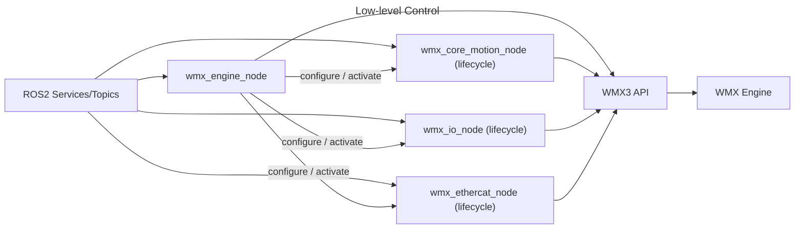
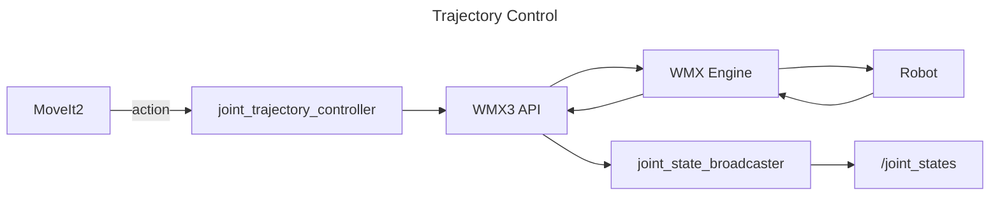
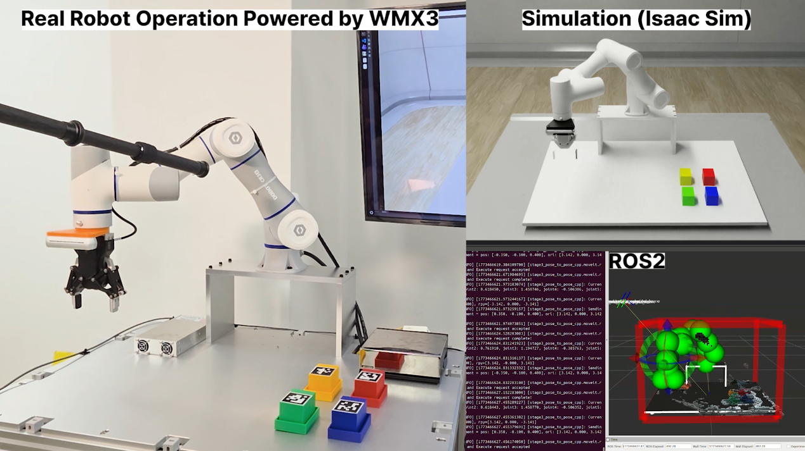

# WMX R2 Application

[](https://github.com/movensys/wmx-r2/actions/workflows/ci.yml)
[](https://docs.ros.org)
[](LICENSE.txt)
[](https://movensys.github.io/wmx-r2-doc/)

ROS2 interface for [WMX3](https://www.movensys.com/en/products/software_motion_control/wmx_en), a real-time EtherCAT motion control SDK by Movensys, enabling control of industrial robots and multi-axis systems from the ROS2 ecosystem.

This package wraps the WMX3 C++ API into standard ROS2 nodes, topics, services, and actions, so you can drive WMX3-controlled hardware (e.g. the Dobot CR3A/CR5A manipulators) using MoveIt2, Nav2, or any ROS2-compatible planner without writing vendor-specific motion code.

## Features

- **Real-time motion:** deterministic multi-axis control over EtherCAT through the WMX3 engine.
- **ROS2 native:** exposes WMX3 as standard nodes, topics, services, and actions.
- **MoveIt2 / Nav2 ready:** trajectory execution and joint-state feedback with no vendor-specific motion code.
- **Full low-level access:** axis, IO, EtherCAT master, and engine control from the command line or your own nodes.
- **Dual distro:** supported and CI-tested on ROS2 **Humble** and **Jazzy**.
- **Hardware-proven:** ships configurations for the Dobot CR3A / CR5A manipulators and a differential-drive base.

## Requirements

> **Note:** This package controls real motion hardware and requires a real-time environment. It is not a simulator.

- **WMX Linux** (real-time patched) with the WMX3 SDK pre-installed (see [WMX installation](https://movensys.github.io/wmx-r2-doc/getting_started/install_wmx3.html)).
- EtherCAT-capable hardware (servo drives / IO reachable from the WMX3 master).
- ROS2 **Humble** or **Jazzy**.
- `rmw_cyclonedds` as the RMW implementation.
- Manipulator launches require **root** (real-time scheduling), started via `sudo --preserve-env`.

## Quickstart

Full environment setup, dependencies, and `~/.bashrc` configuration are in [doc/first_setup.md](doc/first_setup.md).

```bash
# 1. Build (messages first, then the rest)
cd ~/workspaces/movensys_ws
colcon build --packages-select wmx_r2_message
source install/setup.bash
colcon build && source install/setup.bash

# 2. Launch the low-level nodes (engine, core motion, IO, EtherCAT)
ros2 launch wmx_r2_package wmx_r2_general_nodes.launch.py

# 3. Bring axes online and command a move
ros2 service call /wmx/axes/set_servo_on wmx_r2_message/srv/SetAxes "{indices: [0,1], data: [1,1]}"
ros2 topic pub --once /wmx/axes/start_pos wmx_r2_message/msg/AxesPose \
  "{indices: [0,1], positions: [8388608, 10000], velocities: [1000000, 5000], accelerations: [100000, 1000], decelerations: [100000, 1000]}"
```

The full startup sequence and the complete service/topic catalog are documented in
[doc/reference_wmx_r2_general_nodes.md](doc/reference_wmx_r2_general_nodes.md).

## Architecture

### Low-level Control ([wmx_r2_general_nodes.launch.py](wmx_r2_package/launch/wmx_r2_general_nodes.launch.py))


```mermaid
---
title: Low-level Control
---
flowchart LR;
    A[ROS2 Services/Topics] --> B[wmx_engine_node];
    A --> C["wmx_core_motion_node (lifecycle)"];
    A --> D["wmx_io_node (lifecycle)"];
    A --> E["wmx_ethercat_node (lifecycle)"];
    B -->|configure / activate| C;
    B -->|configure / activate| D;
    B -->|configure / activate| E;
    B --> F[WMX3 API];
    C --> F;
    D --> F;
    E --> F;
    F --> G[WMX Engine];
```

`wmx_engine_node` owns the WMX3 engine. Every other WMX node is a
[managed (lifecycle) node](https://design.ros2.org/articles/node_lifecycle.html):
it starts `unconfigured` and only attaches to the device when the engine drives
it to `configure`, then `activate`. Nothing lists those nodes anywhere — the
engine finds them on the ROS graph and brings up each one it has not seen
before, so a node that joins late or respawns is picked up too. This is not
limited to WMX nodes: any managed node in the same namespace (a lifecycle
`joint_state_publisher`, a nav2 node, your own) is brought up the same way.
Individual nodes are driven by name:

```bash
# Lifecycle nodes the manager can see, and their states
ros2 service call /wmx/lifecycle/get_node_states wmx_r2_message/srv/GetNodeStates "{}"

# Drive one node by name
ros2 service call /wmx/lifecycle/set_node_state wmx_r2_message/srv/SetNodeState \
  "{node_name: 'wmx_io_node', transition: 'deactivate'}"

# Drive every node at once: leave node_name empty
ros2 service call /wmx/lifecycle/set_node_state wmx_r2_message/srv/SetNodeState \
  "{node_name: '', transition: 'bringdown'}"
```

`transition` is one of `configure`, `activate`, `deactivate`, `cleanup`,
`shutdown`, `bringup` (configure + activate) or `bringdown` (deactivate).
Transitions that take nodes down are applied in reverse bring-up order. The
standard `ros2 lifecycle` CLI works on the nodes directly as well.

### Trajectory Control ([wmx_r2_cr3a_manipulator.launch.py](wmx_r2_package/launch/wmx_r2_cr3a_manipulator.launch.py))


```mermaid
---
title: Trajectory Control
---
flowchart LR;
    A["MoveIt2"] -->|action| B[joint_trajectory_controller];
    B --> C[WMX3 API];
    C --> D[WMX Engine];
    D --> E[Robot];
    E --> D[WMX Engine];
    D --> C[WMX3 API];
    C --> F[joint_state_broadcaster];
    F --> G["/joint_states"];
```

- `MoveIt2` -> `joint_trajectory_controller` -> WMX3 API -> WMX Engine -> Robot
- Robot -> WMX Engine -> WMX3 API -> `joint_state_broadcaster` -> `/joint_states`

## Packages

| Package | Description |
|---------|-------------|
| [wmx_r2_message](wmx_r2_message/) | Custom messages and services for axis, IO, EtherCAT, and engine control |
| [wmx_r2_package](wmx_r2_package/) | Main nodes, launch files, and robot configurations |

## Nodes

| Node | Role |
|------|------|
| `wmx_engine_node` | Engine and device initialization; manages the lifecycle of every node below |
| `wmx_core_motion_node` | Core motion control and trajectory execution (lifecycle) |
| `wmx_io_node` | IO control for input/output bits and bytes (lifecycle) |
| `wmx_ethercat_node` | EtherCAT master operations, network scan and slave management (lifecycle) |
| `joint_trajectory_controller` | Receives trajectory actions and executes via WMX3 C-Spline (lifecycle) |
| `joint_position_controller` | Follows MoveIt Servo's streamed `JointTrajectory` via WMX3 linear interpolation, so every axis arrives at the same instant (lifecycle) |
| `differential_drive_controller` | Differential-drive command and odometry loop (lifecycle) |
| `joint_state_broadcaster` | Publishes joint feedback from the WMX3 encoder to `/joint_states`; clears alarms and switches the servos on when activated (lifecycle) |
| `gripper_controller` | Gripper command handling for manipulators (lifecycle) |

## Launch Files

| Launch file | Purpose | Nodes started |
|-------------|---------|---------------|
| [wmx_r2_general_nodes.launch.py](wmx_r2_package/launch/wmx_r2_general_nodes.launch.py) | Low-level axis / IO / EtherCAT control | `wmx_engine_node`, `wmx_core_motion_node`, `wmx_io_node`, `wmx_ethercat_node` |
| [wmx_r2_cr3a_manipulator.launch.py](wmx_r2_package/launch/wmx_r2_cr3a_manipulator.launch.py) | Dobot CR3A trajectory control | general nodes + `joint_state_broadcaster`, `joint_trajectory_controller`, `joint_position_controller`, `gripper_controller` |
| [wmx_r2_cr5a_manipulator.launch.py](wmx_r2_package/launch/wmx_r2_cr5a_manipulator.launch.py) | Dobot CR5A trajectory control | general nodes + `joint_state_broadcaster`, `joint_trajectory_controller` |

## Supported Robots

| Robot | Type | Launch file | WMX parameters | Guide |
|-------|------|-------------|----------------|-------|
| Dobot CR3A | 6-axis manipulator | `wmx_r2_cr3a_manipulator.launch.py` | `config/cr3a_wmx_parameters.xml` | [doc/launch_dobot_cr3a_manipulator.md](doc/launch_dobot_cr3a_manipulator.md) |
| Dobot CR5A | 6-axis manipulator | `wmx_r2_cr5a_manipulator.launch.py` | `config/cr5a_wmx_parameters.xml` | [doc/launch_dobot_cr5a_manipulator.md](doc/launch_dobot_cr5a_manipulator.md) |
| Diffbot | Differential-drive base | `wmx_r2_general_nodes.launch.py` | `config/diffbot_wmx_parameters.xml` | [doc/launch_wmx_r2_general_nodes.md](doc/launch_wmx_r2_general_nodes.md) |

## MoveIt2 Integration

To connect with `movensys-manipulator`, change the action name in `config/cr3a_manipulator_config.yaml`:

```yaml
joint_trajectory_action: /movensys_manipulator_arm_controller/follow_joint_trajectory
```

## Documentation

To quickly set up the WMX ROS2 package and explore its key features, follow these steps:

| Doc | Description |
|-----|-------------|
| [doc/first_setup.md](doc/first_setup.md) | Environment setup, dependencies, build |
| [doc/launch_wmx_r2_general_nodes.md](doc/launch_wmx_r2_general_nodes.md) | Launch the WMX general nodes |
| [doc/launch_dobot_cr3a_manipulator.md](doc/launch_dobot_cr3a_manipulator.md) | Launch the Dobot CR3A manipulator |
| [doc/launch_dobot_cr5a_manipulator.md](doc/launch_dobot_cr5a_manipulator.md) | Launch the Dobot CR5A manipulator |
| [doc/reference_wmx_r2_general_nodes.md](doc/reference_wmx_r2_general_nodes.md) | ROS2 service/topic reference with startup sequence |
| [doc/system_test.md](doc/system_test.md) | System-level test procedures |

For the complete and up-to-date documentation, please visit the official site:
**[WMX R2 Documentation](https://movensys.github.io/wmx-r2-doc/)**

## Roadmap

- [x] Low-level axis, IO, and EtherCAT control nodes
- [x] Trajectory control for Dobot CR3A / CR5A
- [x] MoveIt2 integration
- [x] CI on ROS2 Humble and Jazzy (lint + message build/test)
- [ ] Nav2 integration example for mobile bases

## Demo Videos

### Physical AI powered by WMX ROS2 on NVIDIA Jetson Thor
[](https://www.youtube.com/watch?v=h-G9vtAGAIU)

## License

This project is released under the [MIT License](LICENSE.txt).
